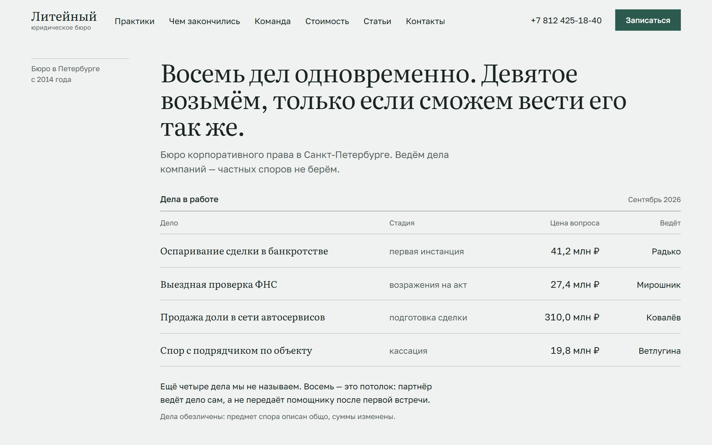
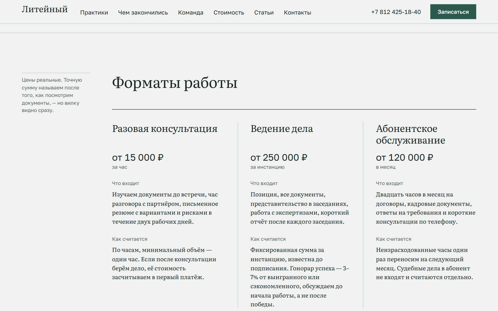

# Юридическое бюро «Литейный»

Одностраничный сайт юридического бюро для бизнеса. Демонстрационный проект: бюро,
сотрудники, дела и реквизиты вымышлены.

Чистые HTML, CSS и JS без сборщика и зависимостей. Серверного кода ровно один
файл — `api/lead.js`, он принимает заявку с формы и пересылает её в Telegram.

Живой адрес: <https://liteiny.vercel.app>

| Первый экран: реестр дел в работе | Форматы работы |
| --- | --- |
|  |  |

## Запуск

Любой статический сервер из корня проекта:

```bash
python -m http.server 5178
```

Открыть http://localhost:5178

Через `file://` сайт не заработает: `js/main.js` подключён как ES-модуль,
браузер не даст загрузить его с файловой системы.

На `localhost` форма работает в демо-режиме: заявка печатается в консоль и
показывается сообщение об успехе. Функции там нет, а к Telegram страница
напрямую не обращается и обращаться не должна.

## Деплой на Vercel

Репозиторий подключён к проекту Vercel, поэтому пуш в `main` разворачивается
сам. Первый раз проект создавался так:

```bash
npx vercel --prod
```

Сборка не нужна: Framework Preset — **Other**, Build Command и Output
Directory пустые. Папку `api` Vercel подхватывает сам и превращает
`api/lead.js` в функцию на `/api/lead`.

При переезде на другой адрес надо поменять три места: `og:url` и `og:image`
в `index.html` и список `DEFAULT_ORIGINS` в `api/lead.js` (либо задать
переменную `ALLOWED_ORIGINS`).

## Приём заявок в Telegram

```
браузер посетителя  →  POST /api/lead (Vercel)  →  Telegram Bot API  →  чат
                          токен живёт здесь
```

Сайт статический, весь его код открыт для чтения. Токен бота в таком коде
равносилен выложенному паролю: чужой человек сможет писать от имени бота.
Поэтому токен хранится в переменных окружения Vercel, а страница обращается
к функции на том же домене.

Что делает обработчик:

- принимает только `POST`, остальным методам отвечает 405;
- отклоняет запросы с чужого `Origin`;
- ловит ботов скрытым полем `company`: если оно заполнено, отвечает успехом,
  но ничего не отправляет;
- проверяет длину полей и число цифр в телефоне;
- экранирует текст, чтобы разметка из полей не сломала сообщение;
- при ошибке Telegram отвечает 502 и не раскрывает токен ни в ответе, ни в логах.

### Настройка

**1. Бот и чат.** Написать [@BotFather](https://t.me/BotFather), команда
`/newbot`, получить токен. Затем написать своему боту любое сообщение, иначе
он не сможет ответить. Свой `chat_id` узнать у [@userinfobot](https://t.me/userinfobot).

**2. Переменные в Vercel.** Settings → Environment Variables, обе для
Production, Preview и Development:

| Переменная           | Значение              |
| -------------------- | --------------------- |
| `TELEGRAM_BOT_TOKEN` | токен от @BotFather   |
| `TELEGRAM_CHAT_ID`   | число от @userinfobot |

Либо из терминала:

```bash
npx vercel env add TELEGRAM_BOT_TOKEN production
npx vercel env add TELEGRAM_CHAT_ID production
```

**3. Redeploy.** Переменные подхватываются при сборке, поэтому после их
добавления нужен новый деплой: `npx vercel --prod` или Redeploy в панели.

Токен в репозиторий не коммитится никогда. Образец переменных — `.env.example`.

## Тесты

```bash
npm test
```

Десять проверок обработчика: методы, чужой `Origin`, ловушка для ботов,
границы полей, экранирование, поведение без переменных окружения и при
ошибке Telegram. Telegram при этом не дёргается — `fetch` подменяется заглушкой.

## Структура

```
index.html
api/
  lead.js          приём заявки и пересылка в Telegram
css/
  tokens.css       переменные: цвет, типографика, ритм, брейкпоинты
  base.css         сброс, базовая типографика, фокус, prefers-reduced-motion
  layout.css       контейнер, отступы секций, дорожка «поля документа»
  components.css   шапка, кнопки, реестр дел, раскрытие, форма, портрет
  sections.css     частности отдельных секций
js/
  main.js          дата реестра, шапка, меню, раскрытия, набор реестра, форма
  send-lead.js     sendLead(data) — отправка заявки
assets/
  team/*.svg       заглушки портретов 600×800, заменить на съёмку
  favicon.svg, apple-touch-icon.png, og.png
tools/
  og-source.html   разметка, из которой отрисована og.png
  touch-source.html
```

### Об отступах между секциями

Вертикальный отступ задан ровно одним правилом в `layout.css`:

```css
.section { padding-block: var(--pad-top, var(--section-pad)) var(--pad-bottom, var(--section-pad)); }
```

Модификатор меняет переменную (`--pad-top`), а не переопределяет `padding`.
Так секции не начинают воевать по специфичности. Разделительная линия —
тоже одно правило, `.section + .section`.

## Форма записи

Отправка вынесена в `js/send-lead.js`, функция `sendLead(data)`: POST с JSON на
`/api/lead`, таймаут десять секунд. При неудаче бросает `LeadError` с понятным
текстом; форма ловит её, показывает сообщение вместе с телефоном бюро и
оставляет введённые данные на месте.

## Как пересобрать og.png

Картинка для превью отрисована из `tools/og-source.html` в headless-браузере.
Если правится заголовок — перерисовать:

```bash
npx --yes playwright screenshot --viewport-size=1200,630 tools/og-source.html assets/og.png
```

Либо открыть файл в браузере и снять скриншот области 1200×630 вручную.

## Что заменить перед боевым запуском

- Фотографии команды: `assets/team/*.svg` → реальные снимки 3:4, одинакового кадра.
- Адрес сайта в `og:url`, `og:image` и в `DEFAULT_ORIGINS` (`api/lead.js`).
- Реквизиты, телефон и почту в `index.html` (шапка, контакты, футер).
- Строку в футере о том, что сайт демонстрационный, и оговорку под формой.

## Поддержка браузеров

Chrome, Edge, Firefox, Safari — актуальные версии.

Выравнивание колонок в блоках «Команда» и «Форматы работы» сделано на CSS
subgrid и обёрнуто в `@supports`. Где subgrid не поддержан, колонки просто
не выстроятся по общим горизонталям — раскладка не ломается.

## Доступность

- Видимый фокус на клавиатуре, ссылка «Перейти к содержанию».
- Контраст всего текста не ниже AA (проверен по парам цвет/фон, минимум 5.4:1).
- `prefers-reduced-motion` убирает набор реестра и переходы.
- Реестр дел на узком экране перестраивается через `display: grid`, но роли
  `table` / `rowgroup` / `row` / `cell` / `columnheader` проставлены в разметке
  явно, а шапка таблицы скрыта `clip-path`, а не `display: none` — заголовки
  столбцов остаются в дереве доступности.
- Раскрытые блоки получают `inert`, пока свёрнуты, чтобы ссылки внутри
  не попадали под Tab.
